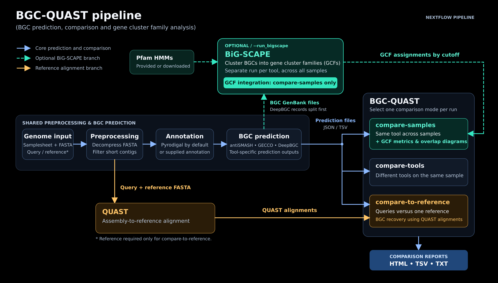

# bgc_quast_ppl

[](https://www.nextflow.io/)
[](https://www.docker.com/)
[](https://github.com/gurevichlab/bgc-quast)
[](https://github.com/medema-group/BiG-SCAPE)

A Nextflow pipeline that predicts **biosynthetic gene clusters (BGCs)** in
genome assemblies and compares the predictions in one report.

## Contents

1. [Introduction](#1-introduction)
2. [Pipeline summary](#2-pipeline-summary)
3. [Quick start](#3-quick-start)
4. [Requirements](#4-requirements)
5. [Installation](#5-installation)
6. [Databases](#6-databases)
7. [The samplesheet](#7-the-samplesheet)
8. [Comparison modes](#8-comparison-modes)
9. [Running the pipeline](#9-running-the-pipeline)
10. [Parameters](#10-parameters)
11. [Output](#11-output)
12. [Important notes](#12-important-notes)
13. [Resuming a run](#13-resuming-a-run)
14. [Troubleshooting](#14-troubleshooting)
15. [Citations](#15-citations)

---

## 1. Introduction

**bgc_quast_ppl** takes one or more genome assemblies and finds the BGCs in
them with three prediction tools: **antiSMASH**, **DeepBGC** and **GECCO**.
It then passes the results to **bgc-quast**, which counts, measures and
compares the predicted BGCs and writes one report per comparison.

bgc-quast is a quality assessment tool for BGC prediction tools, made by the
[Gurevich lab](https://github.com/gurevichlab/bgc-quast). This pipeline runs
all the steps before bgc-quast for you, so you only need your genome files.

You can compare BGCs in three ways:

- **across samples** - one tool, many genomes
- **across tools** - one genome, three tools
- **against a reference** - draft genomes against one high-quality genome

An optional step runs **BiG-SCAPE**, which groups similar BGCs into gene
cluster families (GCFs) and adds family numbers to the reports.

The pipeline reuses parts of [nf-core/funcscan](https://github.com/nf-core/funcscan)
3.0.0 for input preparation, gene annotation and BGC prediction.

---

## 2. Pipeline summary

<p align="center">
  
</p>

1. Unzip the input genomes if they are compressed.
2. Remove short contigs with [SeqKit](https://bioinf.shenwei.me/seqkit/)
   (default: shorter than 3,000 bp).
3. Find genes with [Pyrodigal](https://github.com/althonos/pyrodigal).
   Each genome is annotated once, and the same annotation goes to all three
   prediction tools.
4. Predict BGCs with [antiSMASH](https://antismash.secondarymetabolites.org),
   [DeepBGC](https://github.com/Merck/deepbgc) and
   [GECCO](https://gecco.embl.de/).
5. *Compare-to-reference mode only:* align each draft genome to the reference
   with [QUAST](https://quast.sourceforge.net/).
6. *Optional, compare-samples mode only:* group BGCs into families with
   [BiG-SCAPE](https://github.com/medema-group/BiG-SCAPE).
7. Compare the predictions and write the reports with
   [bgc-quast](https://github.com/gurevichlab/bgc-quast).

---

## 3. Quick start

```bash
export NXF_VER=25.10.5

nextflow run . \
  -profile docker \
  --input samplesheet.csv \
  --outdir results \
  --bgc_antismash_db /absolute/path/to/antismash_db_v8 \
  --bgc_deepbgc_db /absolute/path/to/deepbgc_db \
  --max_cpus 4 \
  --max_memory 24.GB
```

This runs the default mode, **compare-samples**. Read sections 4 to 7 before
your first run.

---

## 4. Requirements

| Requirement | Details |
|---|---|
| Nextflow | Version **25.10.x** only. Tested with 25.10.4 and 25.10.5. Other versions stop at the start. Version 26.01 and newer does **not** work. |
| Docker | Must be installed and **running** before you start. Every tool except bgc-quast runs inside a Docker container. |
| Python 3.9 to 3.13 | With `pandas`, `biopython` and `pyyaml`. bgc-quast runs directly on your machine, not in a container. See [Important notes](#12-important-notes). |
| antiSMASH database | Version 8. See [Databases](#6-databases). |
| DeepBGC database | See [Databases](#6-databases). |
| Pfam-A.hmm | Only if you turn on BiG-SCAPE. It can be downloaded for you. |
| Disk space | Several GB for the databases, plus space for the work folder. |

GECCO needs no database. Its model is inside its container.

---

## 5. Installation

Get the pipeline. Use **one** of these two ways.

With HTTPS (works for everyone):

```bash
git clone https://github.com/Seg0fieD/bgc_quast_ppl.git
cd bgc_quast_ppl
```

With SSH (needs an SSH key added to your GitHub account):

```bash
git clone git@github.com:Seg0fieD/bgc_quast_ppl.git
cd bgc_quast_ppl
```

Fix the Nextflow version. Do this once in **every new terminal**, before any
`nextflow` command:

```bash
export NXF_VER=25.10.5
```

Set up the Python packages bgc-quast needs, for example with conda:

```bash
conda env create -f bin/bgc-quast/environment.yml
conda activate bgc-quast
```

Then install Nextflow in the same environment, or make sure the `nextflow`
command can find this Python.

---

## 6. Databases

antiSMASH and DeepBGC need their databases on disk **before** the run. The
pipeline stops at the start if a path is missing.

| Database | Parameter | How to get it |
|---|---|---|
| antiSMASH v8 | `--bgc_antismash_db` | Follow the [antiSMASH download guide](https://docs.antismash.secondarymetabolites.org/install/). The database must match **antiSMASH 8**. |
| DeepBGC | `--bgc_deepbgc_db` | Run `deepbgc download`. See the [DeepBGC page](https://github.com/Merck/deepbgc). |
| Pfam-A (for BiG-SCAPE) | `--bgc_bigscape_pfam` | Optional. If you leave it out, the pipeline downloads Pfam 38.2 for you. |

> [!IMPORTANT]
> Always give database paths as **absolute paths** (starting with `/`).

**Pfam in detail.** `--bgc_bigscape_pfam` must point to the `Pfam-A.hmm`
**file**, not its folder. The four index files `.h3f`, `.h3i`, `.h3m` and
`.h3p` must sit next to it. If they are missing, run this once:

```bash
hmmpress Pfam-A.hmm
```

If you do not give a Pfam file, the pipeline downloads about 400 MB and needs
about 4 GB of free disk. Add `--save_db` to keep the download in
`<outdir>/databases/pfam/`, so you can reuse it next time.

---

## 7. The samplesheet

The input is a CSV file with a header row. Pass it with `--input`.

| Column | Required | Meaning |
|---|---|---|
| `sample` | Yes | A unique name for the genome. No spaces. |
| `fasta` | Yes | Path to the genome. Allowed endings: `.fasta`, `.fna`, `.fa`, `.fas`, each with or without `.gz`. |
| `type` | Only in compare-to-reference | `q` for a query genome, `r` for the reference. Upper or lower case both work. |

The first two columns must be `sample` and `fasta`, in that order.

**For compare-samples and compare-tools:**

```csv
sample,fasta
assembly_10,data/assembly_10.fasta.gz
assembly_20,data/assembly_20.fasta.gz
```

**For compare-to-reference:** add the `type` column. Use **exactly one**
reference row (`r`) and one or more query rows (`q`).

```csv
sample,fasta,type
assembly_10,data/assembly_10.fasta.gz,q
assembly_20,data/assembly_20.fasta.gz,q
reference,data/reference.fasta.gz,r
```

The name of the reference row is used as the reference label in the report.

Rules to keep in mind:

- Every sample name must be unique.
- If you leave a sample name empty, the pipeline makes one from the file
  name and tells you.
- With BiG-SCAPE on, a sample name must not contain `.region` or
  `_cluster_`. The pipeline uses these to match files and stops if it finds
  them.
- Relative paths are read from the folder you start the pipeline in.

A ready-made example is in `example_test_data/samplesheet.csv`.

---

## 8. Comparison modes

Choose the mode with `--bgc_quast_mode`. Each run uses one mode.

| Mode | What it compares | You get | Use it to answer |
|---|---|---|---|
| `compare-samples` (default) | All samples, one tool at a time | One report per tool | "How do my genomes differ from each other?" |
| `compare-tools` | The three tools, one sample at a time | One report per sample | "For this genome, how do antiSMASH, DeepBGC and GECCO differ?" |
| `compare-to-reference` | Each draft genome against one reference | One report per tool | "How many of the reference BGCs did my drafts recover?" |

What each mode reports:

- **All modes:** number of BGCs, mean BGC length, total BGC span and mean
  number of genes per BGC. Each is also split by product type and by
  completeness. A BGC is *complete* when it does not touch a contig edge.
- **compare-tools:** which BGCs each tool finds alone and which are shared,
  with Venn diagrams. It also writes a combined table and GenBank file of all
  predicted BGCs.
- **compare-to-reference:** how many reference BGCs are fully recovered,
  partly recovered or missed in each draft. QUAST runs for you.
- **compare-samples with BiG-SCAPE:** number of gene cluster families,
  families shared between samples, and a Venn diagram.

For the full list of metrics, see the
[bgc-quast metrics page](https://github.com/gurevichlab/bgc-quast/blob/main/docs/METRICS.md).

> [!NOTE]
> `auto` is listed as a mode but is not available yet. Choosing it stops 
>  the run and an error is thrown at the start-up.

---

## 9. Running the pipeline

Start every run from inside the `bgc_quast_ppl` folder. Replace the paths
with your own.

### Compare samples (default)

```bash
nextflow run . \
  -profile docker \
  --input samplesheet.csv \
  --outdir results \
  --bgc_quast_mode compare-samples \
  --bgc_antismash_db /absolute/path/to/antismash_db_v8 \
  --bgc_deepbgc_db /absolute/path/to/deepbgc_db \
  --max_cpus 2 \
  --max_memory 16.GB
```

### Compare tools

The same command with a different mode:

```bash
  --bgc_quast_mode compare-tools \
```

### Compare to reference

Use a samplesheet with a `type` column and one reference row:

```bash
nextflow run . \
  -profile docker \
  --input samplesheet_ref.csv \
  --outdir results \
  --bgc_quast_mode compare-to-reference \
  --bgc_antismash_db /absolute/path/to/antismash_db_v8 \
  --bgc_deepbgc_db /absolute/path/to/deepbgc_db \
  --max_cpus 2 \
  --max_memory 16.GB
```

### Compare samples with gene cluster families (BiG-SCAPE)

```bash
nextflow run . \
  -profile docker \
  --input samplesheet.csv \
  --outdir results \
  --bgc_quast_mode compare-samples \
  --run_bigscape \
  --bgc_bigscape_pfam /absolute/path/to/Pfam-A.hmm \
  --bgc_antismash_db /absolute/path/to/antismash_db_v8 \
  --bgc_deepbgc_db /absolute/path/to/deepbgc_db \
  --max_cpus 2 \
  --max_memory 16.GB
```

### See all parameters in the terminal

```bash
nextflow run . --help
```

> [!TIP]
> Give parameters on the command line or in a file with `-params-file`. Do
> not put parameters in a custom config file (`-c`). Use config files only
> for settings such as resources.

---

## 10. Parameters

All parameters start with two dashes (`--`). A parameter without a value,
such as `--run_bigscape`, turns an option on. Defaults are shown in the
tables.

### 10.1 Input and output

| Parameter | Default | What it does |
|---|---|---|
| `--input` | - | Path to your samplesheet. **Required.** |
| `--outdir` | - | Folder for the results. **Required.** |
| `--email` | - | Send a short summary email when the run ends. |

### 10.2 Comparison with bgc-quast

| Parameter | Default | What it does |
|---|---|---|
| `--bgc_quast_mode` | `compare-samples` | Which comparison to run: `compare-samples`, `compare-tools` or `compare-to-reference`. See [Comparison modes](#8-comparison-modes). |
| `--bgc_quast_edge_distance` | `100` | A BGC closer than this many bp to a contig edge is labelled *incomplete*. This only labels BGCs. It does not remove any. |
| `--bgc_quast_min_bgc_length` | `0` | Leave out BGCs shorter than this many bp. `0` keeps all BGCs. |
| `--bgc_quast_merge_distance` | `0` | Join two BGCs into one when the gap between them is this many bp or less. `0` turns joining off. |
| `--bgc_quast_overlap_fraction` | `0.9` | How much two BGCs must overlap to count as the same BGC. A number between 0 and 1. Used in compare-tools only. |
| `--bgc_quast_quastdir` | - | Use your own finished QUAST output folder instead of running QUAST. Compare-to-reference only. |
| `--bgc_quast_debug` | `false` | Keep bgc-quast's temporary files, and print the full error message if a step fails. |

### 10.3 BGC prediction: general

| Parameter | Default | What it does |
|---|---|---|
| `--bgc_mincontiglength` | `3000` | Contigs shorter than this many bp are removed before prediction. The same value is used for QUAST. |
| `--bgc_savefilteredcontigs` | `false` | Save the length-filtered contigs to `<outdir>/bgc/seqkit/`. |
| `--bgc_skip_antismash` | `false` | Do not run antiSMASH. |
| `--bgc_skip_deepbgc` | `false` | Do not run DeepBGC. |
| `--bgc_skip_gecco` | `false` | Do not run GECCO. |
| `--run_bgc_screening` | `true` | Leave this on. Turning it off skips BGC prediction and all comparisons. |

### 10.4 antiSMASH

antiSMASH runs in **minimal** mode by default. Minimal mode finds the BGCs
and skips the extra analyses, so it is much faster.

| Parameter | Default | What it does |
|---|---|---|
| `--bgc_antismash_db` | - | Path to the antiSMASH v8 database folder. **Required** unless antiSMASH is skipped. |
| `--bgc_antismash_full` | `false` | Run the full analysis instead of minimal mode. |
| `--bgc_antismash_minimal` | `false` | Run minimal mode. This is already the default, so you do not need it. Do not use it together with `--bgc_antismash_full`. |
| `--bgc_antismash_taxon` | `bacteria` | Type of organism: `bacteria` or `fungi`. |
| `--bgc_antismash_hmmdetectionstrictness` | `relaxed` | How strict BGC detection is: `strict`, `relaxed` or `loose`. `loose` finds more, less certain BGCs. |
| `--bgc_antismash_contigminlength` | `3000` | antiSMASH skips contigs shorter than this many bp. |
| `--bgc_antismash_cbgeneral` | `false` | Compare BGCs with a database of antiSMASH-predicted BGCs (ClusterBlast). |
| `--bgc_antismash_cbknownclusters` | `false` | Compare BGCs with known BGCs from MIBiG (KnownClusterBlast). |
| `--bgc_antismash_cbsubclusters` | `false` | Compare BGCs with known sub-clusters (SubClusterBlast). |
| `--bgc_antismash_ccmibig` | `false` | Compare BGCs with MIBiG using ClusterCompare. |
| `--bgc_antismash_smcogtrees` | `false` | Build family trees for the BGC genes. |
| `--bgc_antismash_pfam2go` | `false` | Link protein domains to Gene Ontology terms. |
| `--bgc_antismash_rre` | `false` | Search RiPP clusters for RRE elements. |
| `--bgc_antismash_tfbs` | `false` | Search for transcription factor binding sites. |

The extra analyses add time and output files. They do not change which BGCs
are found, so they do not change the bgc-quast reports.

### 10.5 DeepBGC

| Parameter | Default | What it does |
|---|---|---|
| `--bgc_deepbgc_db` | - | Path to the DeepBGC database folder. **Required** unless DeepBGC is skipped. |
| `--bgc_deepbgc_score` | `0.5` | Lowest score a region needs to be called a BGC. Higher means fewer, more certain BGCs. |
| `--bgc_deepbgc_classifierscore` | `0.5` | Lowest score needed to give a BGC a product class. |
| `--bgc_deepbgc_minnucl` | `1` | Smallest BGC length to report, in bp. |
| `--bgc_deepbgc_minproteins` | `1` | Smallest number of proteins a BGC must have. |
| `--bgc_deepbgc_mindomains` | `1` | Smallest number of protein domains a BGC must have. |
| `--bgc_deepbgc_minbiodomains` | `0` | Smallest number of known biosynthetic domains a BGC must have. |
| `--bgc_deepbgc_mergemaxproteingap` | `0` | Join BGCs that are this many proteins apart or closer. |
| `--bgc_deepbgc_mergemaxnuclgap` | `0` | Join BGCs that are this many bp apart or closer. |
| `--bgc_deepbgc_prodigalsinglemode` | `false` | Run DeepBGC's own gene finder in single-genome mode. The pipeline already gives DeepBGC the genes, so this usually has no effect. |

### 10.6 GECCO

| Parameter | Default | What it does |
|---|---|---|
| `--bgc_gecco_threshold` | `0.8` | Lowest probability a gene needs to be part of a BGC. Lower gives more and longer BGCs, but less accurate ones. |
| `--bgc_gecco_cds` | `3` | Smallest number of genes a BGC must have. |
| `--bgc_gecco_pfilter` | `1e-9` | p-value cut-off for protein domains. |
| `--bgc_gecco_edgedistance` | `0` | Smallest number of genes between a BGC and the contig edge. |
| `--bgc_gecco_mask` | `false` | Stop genes from running across unknown bases (`N`). |

### 10.7 BiG-SCAPE (gene cluster families)

BiG-SCAPE is **off** by default and runs **only in compare-samples mode**.
With any other mode, `--run_bigscape` stops the run at start-up with an
error. BiG-SCAPE runs once for each prediction tool that is switched on,
over all samples together.

| Parameter | Default | What it does |
|---|---|---|
| `--run_bigscape` | `false` | Turn BiG-SCAPE on. |
| `--bgc_bigscape_pfam` | - | Path to your `Pfam-A.hmm` file. Leave it out to download Pfam automatically. |
| `--bgc_bigscape_pfam_url` | Pfam 38.2 | Where to download Pfam from. Only used when no Pfam file is given. |
| `--bgc_bigscape_cutoffs` | `0.3,0.5,0.7` | Family cut-offs to compute, separated by commas. A lower cut-off makes smaller, tighter families. You can switch between them in the HTML report. |
| `--bgc_bigscape_cutoff` | `0.3` | The cut-off shown in the report table. It must be one of `--bgc_bigscape_cutoffs`. |
| `--bgc_bigscape_dir` | - | Reuse BiG-SCAPE results from an earlier run. Point it at that run's `bgc_quast/bigscape/` folder. Tools found there are not run again. |
| `--bgc_bigscape_classify` | `none` | How BiG-SCAPE sorts BGCs into bins before grouping. Fixed to `none`, because the report reads the single mixed bin. |

### 10.8 Gene annotation

The pipeline finds genes with **Pyrodigal** before prediction.

| Parameter | Default | What it does |
|---|---|---|
| `--annotation_tool` | `pyrodigal` | Gene finder. `pyrodigal` is the only supported choice. |
| `--save_annotations` | `false` | Save the annotation files to `<outdir>/annotation/`. |

<details>
<summary><b>Pyrodigal options</b></summary>

| Parameter | Default | What it does |
|---|---|---|
| `--annotation_pyrodigal_singlemode` | `false` | Use single-genome mode instead of metagenome mode. Single mode needs contigs of at least 20,000 bp. |
| `--annotation_pyrodigal_closed` | `false` | Do not allow genes to run off the contig ends. |
| `--annotation_pyrodigal_transtable` | `11` | Genetic code table. 11 is for bacteria and archaea. |
| `--annotation_pyrodigal_forcenonsd` | `false` | Do a full motif scan instead of the Shine-Dalgarno finder. |
| `--annotation_pyrodigal_usespecialstopcharacter` | `false` | Add `*` at the end of each protein sequence. |

</details>

### 10.9 Resources

| Parameter | Default | What it does |
|---|---|---|
| `--max_cpus` | `2` | Most CPUs any one step may use. |
| `--max_memory` | `8.GB` | Most memory any one step may use. |
| `--max_time` | `24.h` | Longest time any one step may run. |

> [!IMPORTANT]
> The defaults are low. Every step is held to 2 CPUs and 8 GB unless you
> raise them. Set these to fit your computer, for example
> `--max_cpus 4 --max_memory 32.GB`.

### 10.10 Other options

| Parameter | Default | What it does |
|---|---|---|
| `--save_db` | `false` | Keep databases the pipeline downloads (Pfam) in `<outdir>/databases/`. |
| `--publish_dir_mode` | `copy` | How results are placed in `--outdir`: `copy`, `symlink`, `link`, `move` and others. |
| `--email_on_fail` | - | Send an email only when the run fails. |
| `--monochrome_logs` | `false` | Print messages without colour. |
| `--validate_params` | `true` | Check all parameters before the run starts. Leave this on. |

---

## 11. Output

All results go into the folder you gave with `--outdir`.

```
results/
|-- bgc/                          raw output of each prediction tool
|   |-- antismash/<sample>/
|   |-- deepbgc/<sample>/
|   |-- gecco/<sample>/
|   `-- seqkit/                   only with --bgc_savefilteredcontigs
|-- bgc_quast/
|   |-- compare_samples/          compare-samples mode
|   |   |-- antiSMASH/
|   |   |-- DeepBGC/
|   |   `-- GECCO/
|   |-- compare_tools/            compare-tools mode
|   |   `-- <sample>/
|   |-- compare_to_reference/     compare-to-reference mode
|   |   |-- antiSMASH/
|   |   |-- DeepBGC/
|   |   `-- GECCO/
|   |-- quast/                    compare-to-reference mode only
|   `-- bigscape/                 only with --run_bigscape
|       |-- antismash/
|       |-- deepbgc/
|       `-- gecco/
|-- annotation/                   only with --save_annotations
|-- databases/                    only with --save_db
`-- pipeline_info/                run reports, timeline and software versions
```

Only the folder of the mode you ran is created. A skipped tool has no folder.

**Files in each bgc-quast report folder:**

| File | Contents |
|---|---|
| `report.html` | The interactive report. Open it in a web browser. **Start here.** |
| `report.tsv` | The same numbers as a table. |
| `report.txt` | The same numbers as plain text. |
| `bgc-quast.log` | The log of the bgc-quast run. |

In compare-tools mode, each sample folder also has:

| File | Contents |
|---|---|
| `all_tools.bgcs.tsv` | Every BGC from every tool, sorted by position. |
| `all_tools.bgcs.overlaps.tsv` | BGCs grouped where they overlap. |
| `all_tools.bgcs.overlaps.html` | The same groups as a table you can search and filter. |
| `all_tools.bgcs.gbk` | The genome with the BGCs of all tools marked on it. |

Each BiG-SCAPE folder holds BiG-SCAPE's own results, including its
interactive `index.html` page.

---

## 12. Important notes

- **Samples without BGCs** are left out of that tool's report, and the run
  names them. An empty reference gives no report for that tool.
- **Short contigs** below `--bgc_mincontiglength` are removed. A sample with
  none left is skipped, with a warning.
- **One annotation for all tools.** All three tools get the same Pyrodigal
  genes, so tool differences come from BGC finding, not gene finding.
- **Gene counts** come from Pyrodigal. Compare them only within one run.
- **bgc-quast runs outside Docker.** Your Python needs `pandas`,
  `biopython` and `pyyaml` (see [Installation](#5-installation)).
- **Tested setup:** `-profile docker` on Ubuntu 24.04 and macOS. Other
  profiles are untested.
- **GECCO in BiG-SCAPE** uses BiG-SCAPE's experimental `--force-gbk` option.
- **Family numbers are reproducible.** The same input gives the same
  families. To reuse one result, pass it with `--bgc_bigscape_dir`.
- **Pfam is pinned to release 38.2**, because other releases can change the
  families.
- **Compare family numbers at the same cut-off only.**
- **Pre-annotated genomes** (`gbk` and `protein` columns, given together)
  are accepted but untested.

---

## 13. Resuming a run

If a run stops, add `-resume` to the same command. Finished steps are reused
and only the rest runs.

```bash
nextflow run . -profile docker --input samplesheet.csv --outdir results -resume
```

> [!WARNING]
> - Keep the same `--outdir`.
> - Do not change database options on a `-resume`.
> - Changing only `--max_cpus` or `--max_memory` does **not** make a
>   finished step run again.
> - If you edit files inside `bin/bgc-quast/`, run **without** `-resume`.
>   Nextflow does not notice those edits and would reuse the old report.

---

## 14. Troubleshooting

| Problem | What to do |
|---|---|
| `nextflow: command not found` | Install Nextflow, then run `export NXF_VER=25.10.5`. |
| Errors about the Nextflow version | Run `export NXF_VER=25.10.5` in this terminal. Only 25.10.x works; 26.01 and newer fail while reading the config. |
| "Docker does not seem to be running" | Start Docker and run the command again. |
| "Cannot start. Please fix: ..." | The pipeline checked your input and settings before starting. Fix each listed problem and run again. |
| antiSMASH or DeepBGC database errors | Check that the paths are absolute and correct, and that the antiSMASH database is version 8. |
| "Pfam is not pressed" | Run `hmmpress Pfam-A.hmm` once. |
| bgc-quast fails with a Python import error | Install `pandas`, `biopython` and `pyyaml` in the Python that runs Nextflow. |
| Red "did NOT complete successfully" box, but no error | The run ended but produced no comparison. Usually every contig was shorter than `--bgc_mincontiglength`, or no tool found any BGC. Check your genomes. |
| A step failed and you need more detail | Run again with `--bgc_quast_debug` to print the full error message. The failed step's folder in `work/` also has a `.command.err` file with the whole error. |
| The run seems stuck | Check `docker ps` and the step's folder in `work/`. If the step already finished, stop the run and start it again with `-resume`. |

---

## 15. Citations

If you use bgc_quast_ppl, please cite this repository and the version you
used, for example:

> bgc_quast_ppl, version 2.0.1. https://github.com/Seg0fieD/bgc_quast_ppl

Results can change between versions. See [VERSION_LOG.md](VERSION_LOG.md) for
what changed in each one.

Please also cite the tools it runs:

- **bgc-quast** - Kushnareva, Tupikina et al., bioRxiv 2026.
  [Preprint](https://www.biorxiv.org/content/10.64898/2026.05.04.722653),
  [GitHub](https://github.com/gurevichlab/bgc-quast)
- **antiSMASH** - [antiSMASH](https://antismash.secondarymetabolites.org)
- **DeepBGC** - [DeepBGC](https://github.com/Merck/deepbgc)
- **GECCO** - [GECCO](https://gecco.embl.de/)
- **BiG-SCAPE** - [BiG-SCAPE](https://github.com/medema-group/BiG-SCAPE)
- **QUAST** - [QUAST](https://quast.sourceforge.net/)
- **Pyrodigal** - [Pyrodigal](https://github.com/althonos/pyrodigal)
- **SeqKit** - [SeqKit](https://bioinf.shenwei.me/seqkit/)
- **nf-core/funcscan** -
  [docs 3.0.0](https://nf-co.re/funcscan/3.0.0),
  [GitHub 3.0.0](https://github.com/nf-core/funcscan/tree/3.0.0),
  [doi:10.5281/zenodo.7643099](https://doi.org/10.5281/zenodo.7643099)
- **nf-core** - Ewels et al., *Nature Biotechnology* 2020.
  [doi:10.1038/s41587-020-0439-x](https://doi.org/10.1038/s41587-020-0439-x)
- **Nextflow** - [nextflow.io](https://www.nextflow.io/)

Questions and bug reports:
[GitHub Issues](https://github.com/Seg0fieD/bgc_quast_ppl/issues).
